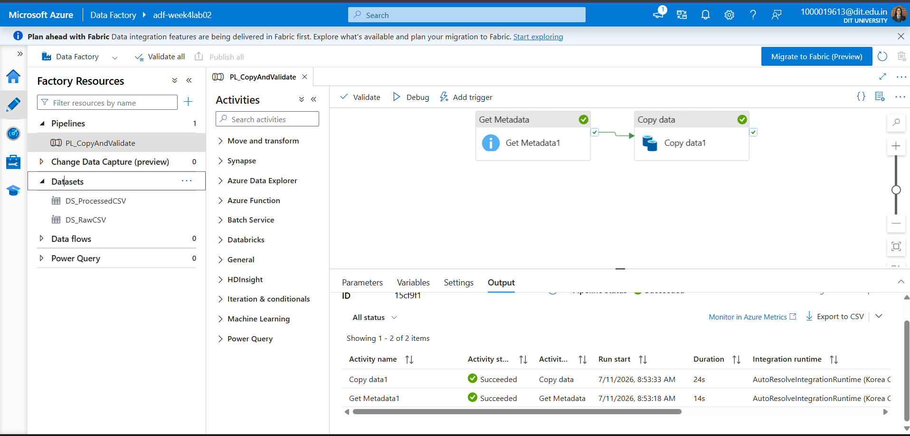
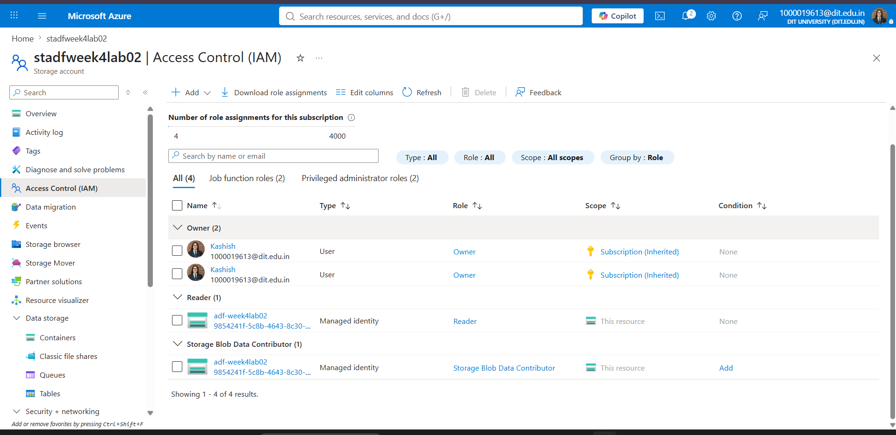

# 🚀 Azure Data Pipeline using Azure Data Factory

**Week 4 Assignment — Celebal Technologies Summer Internship (Data Engineering)**

---

## 📋 Overview

This project demonstrates an **end-to-end data pipeline** built on Microsoft Azure, showcasing cloud best practices for data engineering. The pipeline implements a **metadata-check-then-copy** pattern using Azure Data Factory to validate and securely transfer CSV data from source to destination.

### Core Pipeline: `PL_CopyAndValidate`

```
┌──────────────────┐         ┌─────────────────┐
│  Get Metadata1   │────────▶│  Copy data1     │
│ (Validate Source)│         │ (Copy to Dest)  │
└──────────────────┘         └─────────────────┘
```

---

## 🏗️ Architecture Overview

| Component | Purpose |
|-----------|---------|
| **Resource Group** | Logical container for all Azure resources |
| **Storage Account + Blob Container** | Cloud landing zone for raw CSV data |
| **Azure Data Factory** | Serverless data orchestration engine |
| **Linked Service** | Authenticated ADF ↔ Blob Storage connection |
| **Datasets** (`DS_RawCSV`, `DS_ProcessedCSV`) | Named data pointers (source & destination) |
| **IAM Roles** | Least-privilege managed identity access |

---

## 📸 Pipeline Design & Execution

### Pipeline Architecture

*Visual representation of the data flow through Get Metadata and Copy Data activities*

### Successful Pipeline Run

*Confirmed successful execution with activity durations and metadata validation*

---

## 📊 Dataset

**Source:** [Sample Superstore dataset (Kaggle)](https://www.kaggle.com/datasets/vivek468/superstore-dataset-final)

The dataset contains retail transaction data with multiple attributes for analysis and processing.

---

## ⚙️ How It Works

### Step-by-Step Execution

1. **Get Metadata1** — Validates source file existence
   - Confirms file presence in Blob Storage
   - Reads metadata (size, last-modified timestamp)
   - Fails fast if source is missing or corrupted

2. **Copy data1** — Transfers validated data
   - Copies file from source to destination container
   - Executes only after metadata validation succeeds
   - Maintains data integrity throughout transfer

3. **Monitoring & Insights**
   - Real-time pipeline run status via ADF Monitor
   - Per-activity execution times and error logs
   - Complete output audit trail in ADF console

---

## 📁 Repository Structure

```
Assignment4/
├── README.md                           # This file
├── report/
│   └── Week4_Assignment_Report.docx    # Comprehensive write-up with all screenshots
└── screenshots/
    ├── 01_resource_group.png           # Azure Resource Group setup
    ├── 02_storage_account.png          # Storage Account configuration
    ├── 03_blob_container.png           # Blob Container structure
    ├── 04_adf_overview.png             # Azure Data Factory overview
    ├── 05_linked_service.png           # Linked Service configuration
    ├── 06_dataset_source.png           # Source dataset definition
    ├── 07_dataset_destination.png      # Destination dataset definition
    ├── 08_get_metadata_output.png      # Metadata validation output
    ├── 09_pipeline_design.png          # Pipeline visual design ⭐
    ├── 10_pipeline_run_succeeded.png   # Successful execution result ⭐
    └── 11_pipeline_run_details.png     # Detailed run analytics
```

---

## 🎓 Key Learnings

### Cloud & Infrastructure
- ✅ **Resource Groups** simplify IAM scoping, cost tracking, and resource cleanup
- ✅ **Managed Identities** provide secure, keyless authentication

### Data Factory Design
- ✅ **Linked Services** and **Datasets** are separate concerns in ADF — enables reusability
- ✅ **Get Metadata** is a lightweight validation step to fail fast on missing sources
- ✅ **Debug Runs** iterate quickly without publishing full pipelines

### Security & Access Control
- ✅ **Control-plane vs. Data-plane distinction** — `Contributor` role ≠ blob data access
- ✅ **Least-privilege principle** — assign only required IAM roles
- ✅ **Storage Blob Data Contributor** required for actual read/write blob operations

---

## 🔐 IAM Roles & Permissions

### Managed Identity Roles (on Storage Account)

| Role | Permission | Why It Matters |
|------|-----------|---|
| **Reader** | View storage account & configuration | Read-only metadata access |
| **Storage Blob Data Contributor** | Full read/write blob data | Enables Copy activity to transfer files |

**Why both?** Azure separates resource management (control-plane) from data access (data-plane). The pipeline needs both to function properly.

---

## 👤 Author

**Kashish Chadha**  
Data Engineering Intern · B.Tech (CSE), DIT University · Batch 1  
*Celebal Technologies Summer Internship 2024*

---

**📚 Full documentation** available in [Week4_Assignment_Report.docx](report/Week4_Assignment_Report.docx)
