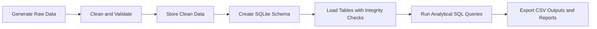

# Assignment 8 - End-to-End E-Commerce Analytics Pipeline

Week 8 Assignment - Celebal Technologies Summer Internship (Data Engineering)

## Overview

This project presents a complete e-commerce analytics pipeline built from scratch. It starts with synthetic raw data, cleans and validates the records, loads them into SQLite, and finally runs analytical SQL queries to produce business insights.

The main idea behind the assignment is simple: real-world data is messy, but analytics only becomes useful when that data is transformed into something reliable, structured, and query-ready.

### What the project demonstrates

- data generation for customers, products, orders, and order items
- data cleaning with explicit quality rules
- relational storage using SQLite
- reusable business logic through SQL views
- reporting through SQL outputs and a terminal-based summary tool

---

## Why this assignment is important

In production systems, data rarely arrives in perfect condition. Common issues include:

- missing customer IDs
- inconsistent date formats
- invalid discounts or quantities
- duplicate records
- orphaned child rows
- return transactions mixed with normal sales

This assignment shows how a data engineering pipeline should respond to those problems in a controlled way instead of simply deleting suspicious rows.

---

## Project architecture

The solution follows a clear layered architecture. Each stage has one responsibility, which keeps the pipeline easy to understand, maintain, and extend.



### Architecture breakdown

| Layer | Purpose |
| --- | --- |
| Data generation | Creates realistic but intentionally imperfect CSV files |
| Data cleaning | Fixes formatting issues, flags invalid rows, and prepares trustworthy data |
| Storage layer | Builds the SQLite database and enforces schema rules |
| Analytics layer | Runs reusable business queries over the cleaned data |
| Reporting layer | Produces CSV outputs, quality reports, and CLI summaries |

---

## Pipeline explanation

### 1. Data generation
The script in [src/generate_data.py](src/generate_data.py) creates synthetic data for the core business entities:

- customers
- products
- orders
- order items

It deliberately injects issues such as malformed dates, negative quantities, invalid discount values, missing customer IDs, and orphaned records. This makes the assignment closer to a real data engineering scenario instead of a perfectly clean demo dataset.

### 2. Data cleaning and validation
The script in [src/clean_data.py](src/clean_data.py) performs the transformation from raw data to clean data.

It:

- parses and standardizes date values
- normalizes product and customer text fields
- clips invalid discounts into a valid range
- marks return transactions clearly
- separates rejected order items for inspection
- generates a data quality report in Markdown and JSON

This stage is important because it preserves useful data while making the dataset safe for analysis.

### 3. Database creation and loading
The script in [src/load_db.py](src/load_db.py) creates the SQLite database from the cleaned CSV files.

It:

- reads the schema from [sql/schema.sql](sql/schema.sql)
- creates customers, products, orders, and order_items tables
- loads the tables in dependency order
- enables foreign key enforcement
- defines the reusable `item_revenue` view for consistent revenue logic

This step converts cleaned files into a relational model that is ready for query execution.

### 4. SQL analytics
The SQL files in [sql/](sql/) contain the actual business analysis.

They answer questions such as:

- which products contribute the most revenue
- which customers are the most valuable
- how sales change across time periods
- which regions perform best
- how returns and cancellations affect performance

The queries demonstrate standard analytical SQL techniques like joins, grouping, ranking, aggregation, and reporting patterns.

### 5. Reporting and output generation
The script in [src/run_queries.py](src/run_queries.py) executes the SQL queries and saves the results into CSV files inside [reports/query_output](reports/query_output).

The script in [src/report_cli.py](src/report_cli.py) provides an interactive report in the terminal with:

- total orders
- revenue
- unique customers
- average order value
- top products
- daily, weekly, or monthly breakdowns

---

## Repository structure

```text
Assignment8/
├── config.py
├── requirements.txt
├── data/
│   ├── raw/
│   ├── clean/
│   └── ecommerce.db
├── reports/
│   ├── data_quality_report.md
│   ├── data_quality_report.json
│   └── query_output/
├── sql/
│   ├── schema.sql
│   ├── 01_basic.sql
│   ├── 02_intermediate.sql
│   └── 03_advanced.sql
├── src/
│   ├── generate_data.py
│   ├── clean_data.py
│   ├── load_db.py
│   ├── run_queries.py
│   └── report_cli.py
└── tests/
```

---

## Setup

### 1. Create a virtual environment

```bash
python -m venv .venv
```

### 2. Activate it

Windows:

```bash
.venv\Scripts\activate
```

macOS / Linux:

```bash
source .venv/bin/activate
```

### 3. Install dependencies

```bash
pip install -r requirements.txt
```

---

## How to run the pipeline

Run the following commands from the project root:

```bash
python src/generate_data.py
python src/clean_data.py
python src/load_db.py
python src/run_queries.py
```

After execution, the project will generate:

- raw data in [data/raw](data/raw)
- cleaned data in [data/clean](data/clean)
- SQLite database in [data/ecommerce.db](data/ecommerce.db)
- quality and query reports in [reports](reports)

---

## Optional commands

### Interactive summary report

```bash
python src/report_cli.py
```

Example with custom date range and granularity:

```bash
python src/report_cli.py --type monthly --from 2025-01-01 --to 2025-06-30
```

### Run a specific query group

```bash
python src/run_queries.py q09
```

---

## Key design decisions

### Keep useful data, not just clean data
The pipeline does not delete everything that looks suspicious. Instead, it keeps legitimate records, isolates rejected rows, and records data-quality issues clearly.

### Centralize business logic
Revenue is calculated through the `item_revenue` view, which prevents the same formula from being repeated across multiple queries.

### Enforce structure
The SQLite schema uses primary keys, foreign keys, and check constraints so that the analytical layer works on reliable relational data.

---

## Deliverables

This assignment produces a complete set of outputs:

- cleaned CSV files
- rejected records file for review
- Markdown and JSON data quality reports
- SQL query outputs as CSV files
- terminal-based analytical summaries

---

## Testing

Run the test suite with:

```bash
pytest -v
```

---

## Troubleshooting

- Run all commands from the Assignment 8 root folder
- Make sure the virtual environment is activated before running scripts
- To regenerate everything from scratch, delete [data](data) and [reports](reports), then rerun the pipeline

---

## Final summary

Assignment 8 is a complete mini data engineering workflow. It shows how raw data moves through generation, cleaning, storage, analysis, and reporting before becoming useful business insight.

That makes it a strong example of practical data pipeline design, SQL analytics, and data quality management.
