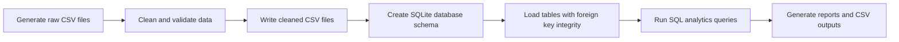

# Assignment 8 - End-to-End E-Commerce Analytics Pipeline

This assignment is a practical example of how a small but realistic data engineering workflow is built from scratch. It takes messy e-commerce data, cleans it, loads it into a relational database, and then runs analytical SQL queries to generate business insights.

In simple words, this project demonstrates the full journey of data:

1. Generate raw data
2. Clean and validate it
3. Store it in a structured format
4. Query it for reporting and decision-making

---

## Why this assignment matters

Real-world data is rarely clean. In production systems, data often contains:

- missing values
- inconsistent formats
- invalid dates
- duplicate records
- broken relationships between tables

This project simulates that reality and shows how a strong pipeline handles these issues responsibly instead of silently ignoring them.

---

## Project goal

The main aim of Assignment 8 is to build a compact analytics pipeline for an e-commerce business that can:

- generate synthetic customer, product, order, and order-item data
- detect and report data quality issues
- clean the data without losing useful information
- load the cleaned data into SQLite
- run business-focused SQL analytics
- produce both tabular outputs and a terminal-based report

---

## Architecture at a glance

The project follows a clean layered architecture, where each stage has a specific responsibility.



### Architectural flow

- Data Generation Layer: creates realistic but imperfect datasets
- Data Cleaning Layer: repairs, standardizes, and flags invalid records
- Storage Layer: creates a relational SQLite database with schema and constraints
- Analytics Layer: runs SQL queries for reporting and business intelligence
- Reporting Layer: outputs query results as CSV files and a summary report in the terminal

---

## What each component does

### 1. Data generation
The script in [src/generate_data.py](src/generate_data.py) creates synthetic data for:

- customers
- products
- orders
- order items

The generated data intentionally contains errors such as:

- missing customer IDs
- malformed dates
- negative quantities
- invalid discounts
- orphaned order items
- future-dated orders

This makes the project realistic and helps demonstrate data quality handling.

### 2. Data cleaning and quality validation
The script in [src/clean_data.py](src/clean_data.py) performs the cleaning process.

It handles:

- date parsing and normalization
- standardizing product names and categories
- converting invalid values into safe defaults
- flagging returns and malformed rows
- separating rejected records into a dedicated output file
- generating a data quality report in Markdown and JSON formats

This stage is especially important because it transforms messy raw data into trustworthy analytical data.

### 3. Database loading
The script in [src/load_db.py](src/load_db.py) creates a SQLite database from the cleaned CSV files.

It:

- reads the schema from [sql/schema.sql](sql/schema.sql)
- creates the tables with constraints and relationships
- loads the data in the correct dependency order
- enables foreign key enforcement
- creates a reusable view called `item_revenue` for centralized revenue logic

This is the bridge between raw cleaned files and analytical querying.

### 4. SQL analytics
The SQL files in [sql/](sql/) contain analytical queries that answer business questions such as:

- which products generate the most revenue
- which customers are the most valuable
- how revenue changes over time
- which regions perform best
- what proportion of orders are canceled or returned

These queries demonstrate common SQL patterns such as joins, aggregations, grouping, ranking, and window functions.

### 5. Reporting layer
The script in [src/run_queries.py](src/run_queries.py) executes the SQL queries and saves each result as a CSV file.

The script in [src/report_cli.py](src/report_cli.py) provides an interactive summary report in the terminal, with metrics such as:

- total orders
- total revenue
- unique customers
- average order value
- top products
- period-based breakdowns

---

## Folder structure

```text
Assignment8/
├── config.py
├── requirements.txt
├── data/
│   ├── raw/
│   ├── clean/
│   └── ecommerce.db
├── reports/
│   ├── data_quality_report.md
│   ├── data_quality_report.json
│   └── query_output/
├── sql/
│   ├── schema.sql
│   ├── 01_basic.sql
│   ├── 02_intermediate.sql
│   └── 03_advanced.sql
├── src/
│   ├── generate_data.py
│   ├── clean_data.py
│   ├── load_db.py
│   ├── run_queries.py
│   └── report_cli.py
└── tests/
```

---

## Setup instructions

### 1. Create a virtual environment

```bash
python -m venv .venv
```

### 2. Activate the environment

On Windows:

```bash
.venv\Scripts\activate
```

On macOS/Linux:

```bash
source .venv/bin/activate
```

### 3. Install dependencies

```bash
pip install -r requirements.txt
```

---

## How to run the full pipeline

Run the scripts from the project root:

```bash
python src/generate_data.py
python src/clean_data.py
python src/load_db.py
python src/run_queries.py
```

This will generate:

- raw data in [data/raw](data/raw)
- cleaned data in [data/clean](data/clean)
- a SQLite database in [data/ecommerce.db](data/ecommerce.db)
- reports in [reports/](reports)

---

## Optional reporting commands

### Interactive CLI report

```bash
python src/report_cli.py
```

You can also pass date range and granularity options:

```bash
python src/report_cli.py --type monthly --from 2025-01-01 --to 2025-06-30
```

### Run a single query group

```bash
python src/run_queries.py q09
```

---

## Important design choices

### Data quality over perfect data
The pipeline does not simply delete bad rows. Instead, it:

- preserves useful information
- flags suspicious values
- stores rejected records separately
- reports issues clearly

This is a much more professional approach than blindly dropping problematic rows.

### Centralized business logic
Revenue calculation is handled in the database view `item_revenue`, which means the logic is defined in one place and reused consistently by all queries.

### Relational integrity
The schema enforces relationships between tables so that the database remains consistent and meaningful.

---

## Output files

The project produces several useful outputs:

- cleaned CSV files
- rejected rows file for review
- data quality reports in Markdown and JSON
- SQL query outputs as CSV files
- terminal-based analytical summaries

---

## Testing

Run the test suite with:

```bash
pytest -v
```

---

## Troubleshooting

- Make sure you run the commands from the Assignment 8 project root
- Ensure the virtual environment is activated
- If you want to regenerate everything from scratch, delete the [data](data) and [reports](reports) folders and rerun the pipeline

---

## Final takeaway

Assignment 8 is not just about writing SQL or cleaning CSV files. It is a complete example of how data flows through a modern analytics workflow:

from messy raw input -> structured storage -> meaningful business insights.

That makes it an excellent project for understanding the practical side of data engineering, analytics, and data quality management.
