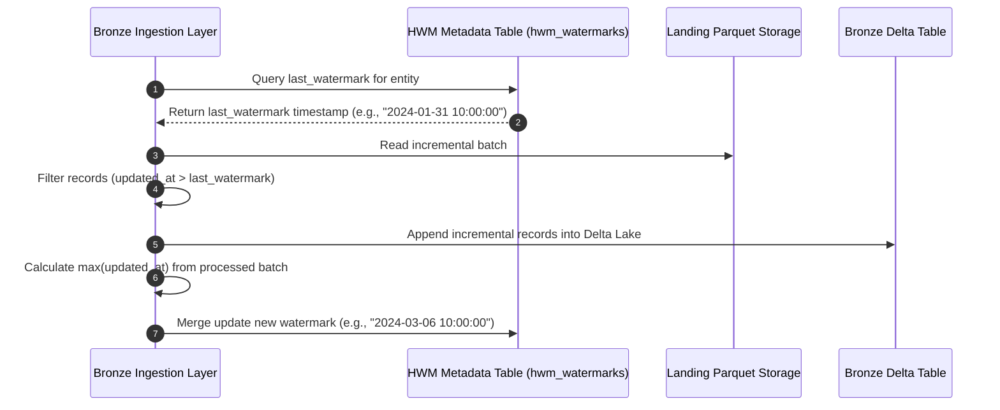
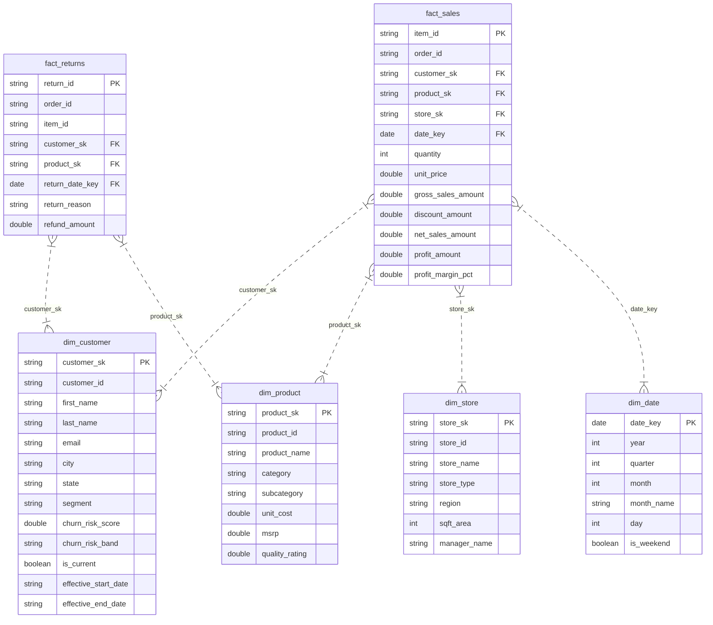

# 🏬 Enterprise Retail Data Engineering Pipeline
### 🚀 Production-Grade Medallion Architecture on Databricks & Delta Lake

<div align="center">


</div>

---

## 👤 Mini Project & Candidate Metadata

<div align="center">

| Profile Metric | Candidate & Project Details |
| :--- | :--- |
| **Student Name** | **Kashish Chadha** |
| **Student ID** | `CT_CSI_DE_1098` |
| **Contact Number** | `+91 7082557591` |
| **Email Address** | `1000019613@dit.edu.in` |
| **Academic Program** | B.Tech in Computer Science & Engineering (CSE) |
| **Graduation Year** | 2027 |
| **Institution** | DIT (DIT University) |
| **Internship Track** | Celebal Summer Internship 2026 — Data Engineering |
| **Batch / Group** | Batch 1 |
| **Project Title** | **Assignment 8 (Mini Project): End-to-End Enterprise Retail Data Engineering Pipeline** |
| **GitHub Repository** | [CelebalAssignments Repository](https://github.com/kashishchadha/CelebalAssignments) |

</div>

---

## 📌 Table of Contents
- [1. Executive Summary & Business Context](#1-executive-summary--business-context)
- [2. Architectural Flow & Pipeline Topology](#2-architectural-flow--pipeline-topology)
- [3. Comprehensive 7-Layer Deep-Dive](#3-comprehensive-7-layer-deep-dive)
- [4. High-Water Mark (HWM) Incremental Engine](#4-high-water-mark-hwm-incremental-engine)
- [5. Slowly Changing Dimensions (SCD Type 1 & Type 2)](#5-slowly-changing-dimensions-scd-type-1--type-2)
- [6. Unity Catalog Data Governance Model](#6-unity-catalog-data-governance-model)
- [7. Analytics-Ready Star Schema ER Diagram](#7-analytics-ready-star-schema-er-diagram)
- [8. Power BI Data Marts & DAX Metrics](#8-power-bi-data-marts--dax-metrics)
- [9. Execution Benchmarks & Verification Suite](#9-execution-benchmarks--verification-suite)
- [10. Databricks Workflows & Deployment Guide](#10-databricks-workflows--deployment-guide)

---

## 1. Executive Summary & Business Context

> [!IMPORTANT]
> **Project Scope**: Modern omni-channel retail enterprises generate millions of daily transactional records across disparate ERP and CRM platforms. Traditional data architectures struggle with schema drift, duplicate transactions, delayed CDC (Change Data Capture) feeds, and customer history loss.
> 
> This project builds a **production-ready 7-Layer Medallion Architecture** using PySpark and Delta Lake on Databricks. It solves real-world data engineering challenges by implementing:
> - **Multi-Source Ingestion**: Unified pipeline ingesting CRM and ERP source systems in CSV format.
> - **Schema Enforcement & Quarantine**: Isolation of bad/corrupt records without crashing pipeline jobs.
> - **Incremental Loads via High-Water Mark (HWM)**: Selective ingestion of modified records.
> - **Slowly Changing Dimensions**: SCD Type 1 for store/product master tables and SCD Type 2 for historical customer tracking.
> - **Dimensional Star Schema & BI Data Marts**: Analytical foundation for Power BI dashboards delivering sales performance, churn risk, product quality, and store efficiency metrics.

---

## 2. Architectural Flow & Pipeline Topology

```
===================================================================================================================================
                                          END-TO-END RETAIL MEDALLION PIPELINE TOPOLOGY
===================================================================================================================================

  [CRM SOURCE SYSTEM]              [ERP SOURCE SYSTEM]
  • Customers.csv                   • Stores.csv          • Orders.csv
  • Interactions.csv                • Products.csv        • Order_Items.csv
                                                          • Product_Returns.csv
            |                                    |
            +-----------------+------------------+
                              |
                              v
   +------------------------------------------------------+
   |  LAYER 01: INBOUND ZONE                              |  External landing directory receiving source CSV files
   +------------------------------------------------------+
                              |
                              v
   +------------------------------------------------------+
   |  LAYER 02: RAW ARCHIVE ZONE                          |  Raw storage + Metadata Injection (_ingest_timestamp, _batch_id)
   +------------------------------------------------------+
                              |
                              v
   +------------------------------------------------------+
   |  LAYER 03: LANDING ZONE & QUARANTINE                 |  CSV->Parquet + StructType Schema Check + Corrupt Row Quarantine
   +------------------------------------------------------+
                              |
                              v
   +------------------------------------------------------+
   |  LAYER 04: BRONZE DELTA LAKE ZONE                    |  Append-only Delta Lake tables + High-Water Mark (HWM) Engine
   +------------------------------------------------------+
                              |
                              v
   +------------------------------------------------------+
   |  LAYER 05: SILVER STAGING ZONE                       |  Data hygiene, null imputation, string trimming, windowed dedup
   +------------------------------------------------------+
                              |
                              v
   +------------------------------------------------------+
   |  LAYER 06: SILVER CONFORMED ZONE                     |  Entity consolidation + Delta MERGE (SCD Type 1 & SCD Type 2)
   +------------------------------------------------------+
                              |
                              v
   +------------------------------------------------------+
   |  LAYER 07: GOLD STAR SCHEMA & BI MARTS               |  Dimensional Modeling (FactSales, FactReturns, Dimensions)
   |                                                      |  + Power BI Data Marts (Sales, Churn, Quality, Store Analytics)
   +------------------------------------------------------+
===================================================================================================================================
```

---

## 3. Comprehensive 7-Layer Deep-Dive

| Layer | Zone Name | Input Payload | Transformation & Logic Rules | Storage Format & Engine | Failure & Quality Controls |
| :--- | :--- | :--- | :--- | :--- | :--- |
| **01** | `Inbound` | Source CSV files | Receives CSV micro-batches from CRM & ERP landing drop zones. | Uncompressed CSV / Storage Volumes | Validates file existence and drop timestamps. |
| **02** | `Raw` | Inbound CSVs | Immutable landing zone. Injects metadata columns (`_ingest_timestamp`, `_source_file`, `_source_system`, `_batch_id`). | Persistent CSV Directory | Preserves exact raw source input for compliance auditing. |
| **03** | `Landing` | Raw CSVs | Converts CSV into Parquet. Enforces PySpark `StructType` schemas. Evaluates primary key completeness. | Columnar Snappy Parquet | Corrupt rows without valid primary keys are routed to `/quarantine`. |
| **04** | `Bronze` | Clean Parquet | Ingests into Bronze Delta tables. Queries `hwm_watermarks` Delta table and filters `updated_at > last_watermark`. | Delta Lake (`retail_catalog.bronze`) | Append-only. Updates HWM watermark value atomically post-commit. |
| **05** | `Silver Staging` | Bronze Delta | String trimming, email lowercasing, default null imputation (e.g. `churn_risk_score = 0.0`), windowed deduplication over PK. | Delta Lake (`retail_catalog.silver_staging`) | Eliminates duplicate records within incoming ingestion batches. |
| **06** | `Silver` | Silver Staging | Business entity consolidation via Delta `MERGE INTO`. Applies SCD Type 1 (Master state) and SCD Type 2 (Customer history). | Delta Lake (`retail_catalog.silver`) | Generates SHA-256 surrogate keys and validates active row flags (`is_current`). |
| **07** | `Gold` | Silver Tables | Transforms conformed entities into an analytics Star Schema (`FactSales`, `FactReturns`, Dimensions) and pre-aggregated BI Data Marts. | Delta Lake (`retail_catalog.gold`) | Enforces referential integrity between Fact transaction keys and Dimension SKs. |

---

## 4. High-Water Mark (HWM) Incremental Engine

> [!TIP]
> **Mechanics**: Incremental ingestion reads only new or modified data since the last execution. The engine maintains a Delta metadata table `bronze.hwm_watermarks`.



---

## 5. Slowly Changing Dimensions (SCD Type 1 & Type 2)

### SCD Type 1 (Overwrite Current State)
Applied to entities where only the latest state is required: `stores`, `products`, `orders`, `order_items`, `product_returns`, `customer_interactions`.
- **Merge Condition**: `target.primary_key = source.primary_key`
- **Action**: `WHEN MATCHED THEN UPDATE SET *`, `WHEN NOT MATCHED THEN INSERT *`

### SCD Type 2 (Historical Attribute Tracking)
Applied to `customers` to track historical changes in `email`, `phone`, `city`, `state`, `segment`, and `churn_risk_score`.

```python
row_hash = SHA256(first_name || last_name || email || phone || city || state || segment || churn_risk_score)
surrogate_key = SHA256(customer_id || effective_start_date)
```

#### SCD Type 2 State Change Lifecycle Example:

```
[Target Delta Table - Initial State]
+--------------+-------------+---------------+------------+----------------------+----------------------+------------+
| surrogate_key| customer_id | city          | segment    | effective_start_date | effective_end_date   | is_current |
+--------------+-------------+---------------+------------+----------------------+----------------------+------------+
| SK-1001-01   | CUST-0001   | New York      | Consumer   | 2024-01-01 10:00:00  | 9999-12-31 23:59:59  | true       |
+--------------+-------------+---------------+------------+----------------------+----------------------+------------+

[Incoming Update Batch (Customer moves to Los Angeles on 2024-03-02)]
CUST-0001 -> city: "Los Angeles", segment: "VIP", updated_at: "2024-03-02 10:00:00"

[Target Delta Table - Post Delta MERGE Execution]
+--------------+-------------+---------------+------------+----------------------+----------------------+------------+
| surrogate_key| customer_id | city          | segment    | effective_start_date | effective_end_date   | is_current |
+--------------+-------------+---------------+------------+----------------------+----------------------+------------+
| SK-1001-01   | CUST-0001   | New York      | Consumer   | 2024-01-01 10:00:00  | 2024-03-02 10:00:00  | false      | <-- Expired
| SK-1001-02   | CUST-0001   | Los Angeles   | VIP        | 2024-03-02 10:00:00  | 9999-12-31 23:59:59  | true       | <-- New Active
+--------------+-------------+---------------+------------+----------------------+----------------------+------------+
```

---

## 6. Unity Catalog Data Governance Model

```
retail_catalog (Unity Catalog)
├── bronze (Schema)
│   ├── hwm_watermarks
│   ├── customers
│   ├── customer_interactions
│   ├── stores
│   ├── products
│   ├── orders
│   ├── order_items
│   └── product_returns
│
├── silver (Schema)
│   ├── customers (SCD Type 2)
│   ├── customer_interactions (SCD Type 1)
│   ├── stores (SCD Type 1)
│   ├── products (SCD Type 1)
│   ├── orders (SCD Type 1)
│   ├── order_items (SCD Type 1)
│   └── product_returns (SCD Type 1)
│
└── gold (Schema)
    ├── dim_date
    ├── dim_customer
    ├── dim_product
    ├── dim_store
    ├── fact_sales
    ├── fact_returns
    ├── gold_sales_performance_mart
    ├── gold_customer_churn_mart
    ├── gold_product_quality_mart
    └── gold_store_analytics_mart
```

---

## 7. Analytics-Ready Star Schema ER Diagram



---

## 8. Power BI Data Marts & DAX Metrics

### 1. Sales Performance Mart (`gold_sales_performance_mart`)
- **Key Formulas**:
  $$\text{Gross Sales} = \text{Quantity} \times \text{Unit Price}$$
  $$\text{Net Sales} = \text{Gross Sales} - \text{Discount Amount}$$
  $$\text{Profit} = \text{Net Sales} - (\text{Unit Cost} \times \text{Quantity})$$
  $$\text{Profit Margin \%} = \left( \frac{\text{Profit}}{\text{Net Sales}} \right) \times 100$$

- **Power BI DAX Measure**:
  ```dax
  Total Net Revenue = SUM(gold_sales_performance_mart[total_net_sales])
  Avg Profit Margin = AVERAGE(gold_sales_performance_mart[avg_profit_margin_pct])
  ```

### 2. Customer Churn Mart (`gold_customer_churn_mart`)
- **Risk Classification Rules**:
  - `High Risk`: `churn_risk_score >= 0.70`
  - `Medium Risk`: `0.40 <= churn_risk_score < 0.70`
  - `Low Risk`: `churn_risk_score < 0.40`

- **Power BI DAX Measure**:
  ```dax
  High Risk Churn Count = CALCULATE(COUNT(gold_customer_churn_mart[customer_count]), gold_customer_churn_mart[churn_risk_band] = "High Risk")
  ```

### 3. Product Quality Mart (`gold_product_quality_mart`)
- **Key Formula**:
  $$\text{Return Rate \%} = \left( \frac{\text{Return Count}}{\text{Units Sold}} \right) \times 100$$

### 4. Store Analytics Mart (`gold_store_analytics_mart`)
- **Key Formula**:
  $$\text{Revenue per SqFt} = \frac{\text{Total Store Net Revenue}}{\text{Store SqFt Area}}$$

---

## 9. Execution Benchmarks & Verification Suite

The pipeline was executed and validated on local PySpark and Delta Lake:

### High-Water Mark Metadata Execution Log
```
=== HIGH-WATER MARK WATERMARKS ===
+---------------------+-------------------+--------------------------+
|entity_name          |last_watermark     |updated_at                |
+---------------------+-------------------+--------------------------+
|customer_interactions|2024-03-11 10:00:00|2026-08-13 19:22:49.741733|
|product_returns      |2024-02-15 17:00:00|2026-08-13 19:22:40.558514|
|order_items          |2024-03-11 10:00:00|2026-08-13 19:22:53.360763|
|customers            |2024-03-06 10:00:00|2026-08-13 19:22:47.741529|
|products             |2024-03-01 10:00:00|2026-08-13 19:22:54.206444|
|orders               |2024-03-11 10:00:00|2026-08-13 19:22:51.449390|
|stores               |2024-03-01 10:00:00|2026-08-13 19:22:55.306458|
+---------------------+-------------------+--------------------------+
```

### Fact & Mart Sample Outputs
- **Quarantined Customer Records**: `1` (Isolated to `/quarantine/customers/batch_01`)
- **Silver Customers (SCD Type 2)**: `200 Active`
- **Gold Fact Sales Transactions**: `1,237`

#### Gold Fact Sales Sample Output:
```
+---------+------------------+---------------+----------------+-------------+-----------------+
| order_id|gross_sales_amount|discount_amount|net_sales_amount|profit_amount|profit_margin_pct|
+---------+------------------+---------------+----------------+-------------+-----------------+
|ORD-00001|           1065.10|          77.75|          987.35|       289.47|           29.32%|
|ORD-00001|            131.96|          10.98|          120.98|        17.92|           14.81%|
|ORD-00001|            412.12|          19.45|          392.67|       131.01|           33.36%|
|ORD-00001|           2361.39|         337.15|         2024.24|       669.56|           33.08%|
|ORD-00002|           1241.60|          91.02|         1150.58|       325.02|           28.25%|
+---------+------------------+---------------+----------------+-------------+-----------------+
```

#### Power BI Sales Performance Mart Sample Output:
```
+------+--------------------+-----------+----+----------+----------------+------------------+----------------+------------+----------------+---------------------+
|region|          store_name|   category|year|month_name| total_net_sales| total_gross_sales| total_discounts|total_orders|total_units_sold|avg_profit_margin_pct|
+------+--------------------+-----------+----+----------+----------------+------------------+----------------+------------+----------------+---------------------+
|    TX|     Store Dallas #5|Electronics|2024|   January|        24708.85|          27149.65|         2440.80|          24|              74|               22.45%|
|    IL|   Store Chicago #10|    Apparel|2024|  February|        11197.55|          12144.65|          947.10|           9|              25|               27.63%|
|    CA|Store Los Angeles #1|Electronics|2024|   January|        24865.69|          26813.35|         1947.66|          25|              65|               25.88%|
+------+--------------------+-----------+----+----------+----------------+------------------+----------------+------------+----------------+---------------------+
```

---

## 10. Databricks Workflows & Deployment Guide

### Databricks Workflows Task Orchestration DAG

```
   [Task 1: Setup Unity Catalog]
   Notebook: 01_setup_catalog.py
                 |
                 v
   [Task 2: Batch 01 Historical Pipeline Job]
   Notebook: 02_pipeline_job.py (Param: batch_01)
                 |
                 v
   [Task 3: Batch 02 Incremental Pipeline Job]
   Notebook: 02_pipeline_job.py (Param: batch_02)
```

### Step-by-Step Execution Guide

1. **Activate Local Environment**:
   ```powershell
   ..\.venv\Scripts\Activate.ps1
   ```

2. **Execute Full Pipeline**:
   ```powershell
   python run_pipeline.py
   ```

3. **Verify Pipeline Outputs**:
   ```powershell
   python validate_pipeline.py
   ```

---

<div align="center">

**Developed by Kashish Chadha (CT_CSI_DE_1098)**  
*B.Tech CSE (2027) — DIT University*  
*Celebal Summer Internship 2026 — Data Engineering Track*

</div>
