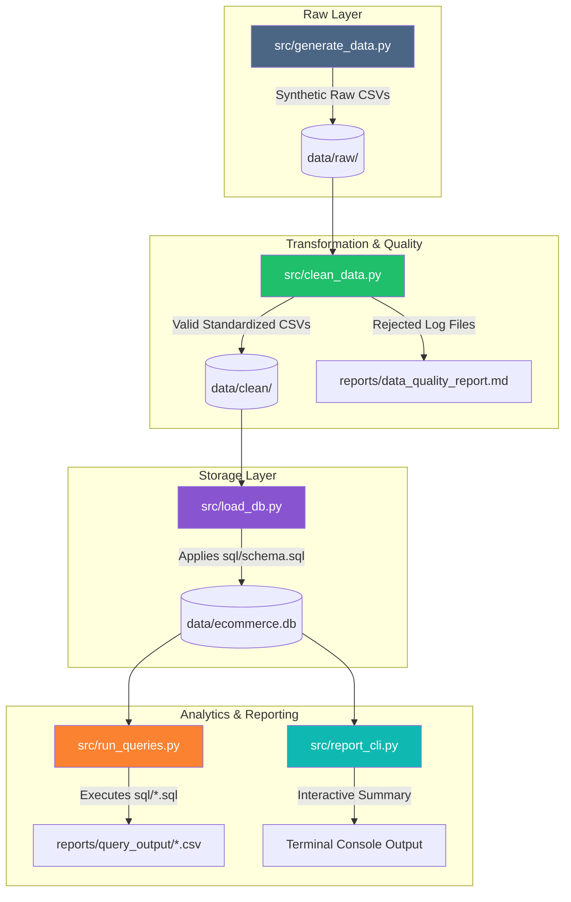

# 🛒 E-Commerce Data Analytics Pipeline

[](https://python.org)
[](https://sqlite.org)
[](https://pandas.pydata.org)
[](https://docs.pytest.org)
[](#-pipeline-execution)

> **Celebal Technologies Summer Internship — Data Engineering (Week 8 Assignment)**  
> *An end-to-end, production-grade e-commerce data pipeline demonstrating synthetic data generation, data quality enforcement, SQLite database loading, advanced analytical SQL, and an interactive terminal CLI report dashboard.*

---

## 📌 Table of Contents

- [Overview](#-overview)
- [Key Features](#-key-features)
- [Pipeline Architecture](#-pipeline-architecture)
- [Detailed Pipeline Stages](#-detailed-pipeline-stages)
  - [1. Data Generation \& Anomaly Injection](#1-data-generation--anomaly-injection)
  - [2. Data Cleaning \& Quality Auditing](#2-data-cleaning--quality-auditing)
  - [3. SQLite Data Warehouse \& Schema](#3-sqlite-data-warehouse--schema)
  - [4. Analytical SQL Engine](#4-analytical-sql-engine)
  - [5. Reporting \& CLI Dashboard](#5-reporting--cli-dashboard)
- [Repository Structure](#-repository-structure)
- [Quick Start Guide](#-quick-start-guide)
- [CLI Dashboard Usage](#-cli-dashboard-usage)
- [Analytical Query Catalog](#-analytical-query-catalog)
- [Engineering Design Decisions](#-engineering-design-decisions)
- [Testing \& Quality Assurance](#-testing--quality-assurance)
- [Outputs \& Deliverables](#-outputs--deliverables)
- [Troubleshooting](#-troubleshooting)

---

## 💡 Overview

In production data engineering systems, raw data is rarely clean or ready for immediate analysis. Real-world datasets suffer from missing identifiers, inconsistent dates, invalid discounts, negative quantities, duplicate entries, and return transactions.

This project implements a **robust, resilient 5-stage ETL/ELT pipeline**. Instead of silently dropping rows or failing mid-execution, the pipeline cleans valid data, flags/isolates corrupted records, loads clean data into SQLite with strict schema constraints, and exposes business metrics via analytical SQL and terminal CLI dashboards.

> [!NOTE]
> The primary objective of this assignment is to prove how a modern data pipeline handles messy incoming data systematically, enforcing data quality rules before computing business-critical KPIs.

---

## ⭐ Key Features

| Feature | Description |
| :--- | :--- |
| **⚡ Synthetic Anomaly Engine** | Generates realistic e-commerce datasets with intentionally injected real-world defects (e.g., malformed dates, orphan items, negative quantities). |
| **🧹 Data Quality Auditing** | Automatically standardizes data, clips out-of-bounds values, isolates rejected records into review tables, and generates audit logs (`.md` & `.json`). |
| **🗄️ Relational SQLite Warehouse** | Builds an optimized relational schema with Primary Keys, Foreign Keys, CHECK constraints, and automated revenue calculation SQL views. |
| **📊 Advanced SQL Analytics** | Includes basic, intermediate, and advanced SQL suites covering YoY growth, customer LTV, product return rates, regional trends, and period revenue. |
| **🖥️ Interactive Terminal CLI** | Command-line summary tool providing period-over-period comparisons (daily/weekly/monthly), AOV calculations, and top-selling product breakdowns. |
| **🧪 Comprehensive Test Suite** | Full unit and edge-case testing using `pytest` to guarantee deterministic pipeline execution and quality rules. |

---

## 📐 Pipeline Architecture

The pipeline uses a decoupled, layered architecture where each module has a single, well-defined responsibility:



### Architecture Breakdown

| Layer | Component | Description | Primary File(s) |
| :--- | :--- | :--- | :--- |
| **1. Data Generation** | Raw Synthetic Generator | Generates customers, products, orders, and order items with realistic dirtiness | [src/generate_data.py](src/generate_data.py) |
| **2. Cleaning & Audit** | Quality Engine | Cleans formats, clips outliers, isolates invalid rows, and logs quality audits | [src/clean_data.py](src/clean_data.py) |
| **3. Data Warehouse** | SQLite Storage | Enforces schema constraints, foreign keys, and common views | [src/load_db.py](src/load_db.py) \| [sql/schema.sql](sql/schema.sql) |
| **4. SQL Engine** | Query Runner | Runs analytical SQL benchmarks and outputs result CSVs | [src/run_queries.py](src/run_queries.py) \| [sql/](sql/) |
| **5. Presentation** | Terminal CLI | Produces period-over-period analytical reports in the CLI | [src/report_cli.py](src/report_cli.py) |

---

## 🔬 Detailed Pipeline Stages

### 1. Data Generation & Anomaly Injection

The script [`src/generate_data.py`](src/generate_data.py) constructs synthetic datasets for 4 core e-commerce entities. It deliberately introduces controlled data quality defects to test pipeline resilience:

- **Missing Foreign Keys:** Null `customer_id` rows (`5%`).
- **Data Format Errors:** Mixed date formats (`YYYY-MM-DD`, `DD/MM/YYYY`, `MM-DD-YYYY`) (`2%`).
- **Domain Constraint Breaches:** Negative quantities (`3%`), discounts $> 100\%$ or $< 0\%$ (`1%`).
- **Dirty Text Data:** Raw product titles containing excess whitespace and erratic casing (`8%`).
- **Relational Anomalies:** Orphan order items (`25` rows), future-dated orders (`12` rows), and high return-prone products (`20` SKUs with `60%` return rates).

### 2. Data Cleaning & Quality Auditing

The script [`src/clean_data.py`](src/clean_data.py) processes raw CSV files and applies validation rules:

1. **Standardization:** Converts all dates to standard `YYYY-MM-DD` ISO format.
2. **Text Normalization:** Trims whitespace and normalizes text casing.
3. **Domain Bounds Enforcement:** Clips invalid discounts to `[0.0, 1.0]`.
4. **Data Isolation:** Moves corrupted/orphan order items to `rejected_order_items.csv` rather than silently dropping or crashing.
5. **Quality Reporting:** Generates human-readable Markdown (`data_quality_report.md`) and machine-readable JSON (`data_quality_report.json`) summaries.

> [!TIP]
> **Data Retention Principle:** Isolating rejected rows into audit files ensures full trace-ability for upstream source system debugging without contaminating analytical metrics.

### 3. SQLite Data Warehouse & Schema

The script [`src/load_db.py`](src/load_db.py) initializes the relational SQLite database [`data/ecommerce.db`](data/ecommerce.db) using [`sql/schema.sql`](sql/schema.sql):

- **Foreign Key Constraints:** Enforces relational integrity across tables.
- **CHECK Constraints:** Guarantees `unit_price >= 0`, `quantity > 0`, and valid `status` values.
- **Centralized Revenue View:** Defines the `item_revenue` SQL view:
  $$\text{Line Revenue} = \text{quantity} \times \text{unit\_price} \times (1 - \text{discount})$$
  This eliminates duplicate logic across analytical queries.

### 4. Analytical SQL Engine

The pipeline executes SQL queries organized into 3 files under [`sql/`](sql/):

1. [`01_basic.sql`](sql/01_basic.sql): Base metrics (total sales, order counts, status breakdowns, top products).
2. [`02_intermediate.sql`](sql/02_intermediate.sql): Aggregated metrics (monthly trends, customer segmentation, category performance, regional sales).
3. [`03_advanced.sql`](sql/03_advanced.sql): Complex analytical queries (Year-over-Year sales growth, customer retention/repeat rate, return rate by product, customer lifetime value ranking).

### 5. Reporting & CLI Dashboard

The script [`src/report_cli.py`](src/report_cli.py) provides interactive analytical insight directly from the command line, featuring period-over-period comparative metrics (Current vs Previous period % change), Average Order Value (AOV), and top-performing products.

---

## 📂 Repository Structure

```text
Assignment8/
├── 📄 README.md                  # Detailed project documentation & user guide
├── ⚙️ config.py                 # Centralized configuration, data knobs & path constants
├── 📦 requirements.txt          # Third-party Python dependencies (pandas, pytest)
├── 🗂️ data/                     # Data storage directory (Git-ignored contents)
│   ├── 📁 raw/                  # Generated raw CSV files with intentionally injected defects
│   ├── 📁 clean/                # Cleaned, standardized CSV files ready for DB ingestion
│   └── 💾 ecommerce.db          # Processed relational SQLite database
├── 📊 reports/                  # Pipeline output reports & query exports
│   ├── 📄 data_quality_report.md# Human-readable data audit log
│   ├── 📋 data_quality_report.json# Programmatic audit log
│   └── 📁 query_output/         # CSV query result files exported by src/run_queries.py
├── 🛢️ sql/                      # Relational DDL & SQL analytics query suite
│   ├── 📄 schema.sql            # Table definitions, DDL, constraints & view setup
│   ├── 📄 01_basic.sql          # Basic SQL queries (Q01 - Q05)
│   ├── 📄 02_intermediate.sql   # Intermediate SQL queries (Q06 - Q10)
│   └── 📄 03_advanced.sql       # Advanced analytical queries (Q11 - Q15)
├── 🐍 src/                      # Pipeline source code modules
│   ├── 🔹 generate_data.py      # Synthetic raw data generator & fault injector
│   ├── 🔹 clean_data.py         # Data quality validator & transformer
│   ├── 🔹 load_db.py            # SQLite schema builder & data loader
│   ├── 🔹 run_queries.py        # SQL query execution engine & CSV exporter
│   └── 🔹 report_cli.py         # Interactive CLI report dashboard
└── 🧪 tests/                    # Pipeline verification & edge-case test suite
    └── 📄 test_edge_cases.py    # Pytest unit tests for cleaning, schemas & edge cases
```

---

## 🚀 Quick Start Guide

### Prerequisites

- **Python:** `3.10` or higher installed.
- **Git:** For cloning and version control.

### Step 1. Clone & Set Up Environment

```bash
# Navigate to the assignment root folder
cd Assignment8

# Create a virtual environment
python -m venv .venv
```

### Step 2. Activate Virtual Environment

- **Windows (PowerShell / Command Prompt):**
  ```powershell
  .venv\Scripts\activate
  ```
- **macOS / Linux:**
  ```bash
  source .venv/bin/activate
  ```

### Step 3. Install Dependencies

```bash
pip install -r requirements.txt
```

---

## ⚡ Execution

Run the complete pipeline end-to-end with the following command sequence:

```bash
# 1. Generate synthetic raw data with anomalies
python src/generate_data.py

# 2. Clean raw data and produce quality reports
python src/clean_data.py

# 3. Create SQLite schema and load clean tables
python src/load_db.py

# 4. Run SQL analytics and generate CSV reports
python src/run_queries.py
```

> [!TIP]
> **One-Liner Execution:**
> ```bash
> python src/generate_data.py && python src/clean_data.py && python src/load_db.py && python src/run_queries.py
> ```

---

## 💻 CLI Dashboard Usage

Run the interactive terminal reporting tool:

```bash
python src/report_cli.py
```

### Command Line Arguments

You can bypass interactive prompts by specifying command line flags:

```bash
python src/report_cli.py --type monthly --from 2025-01-01 --to 2025-06-30
```

#### Available Parameters:

| Flag | Description | Options | Example |
| :--- | :--- | :--- | :--- |
| `--type` | Granularity of breakdown buckets | `daily`, `weekly`, `monthly` | `--type monthly` |
| `--from` | Report window start date | `YYYY-MM-DD` | `--from 2025-01-01` |
| `--to` | Report window end date | `YYYY-MM-DD` | `--to 2025-06-30` |

### Sample Output Preview

```text
==============================================================
MONTHLY REPORT   2025-01-01 to 2025-06-30
compared with    2024-07-04 to 2024-12-31
==============================================================

Metric                     Current      Previous        Change
--------------------------------------------------------------
Total orders                   412           395         +4.3%
Revenue                 184,320.50    172,110.00         +7.1%
Unique customers               310           298         +4.0%

Average order value: 447.38

Top 3 products
--------------------------------------------------------------
1. Ultra HD Wireless Headphones           142 units     14,200.00
2. Ergonomic Gaming Chair                 110 units     22,000.00
3. Smart Fitness Watch                    215 units     19,350.00

Breakdown (monthly)
--------------------------------------------------------------
Period                Orders           Revenue
2025-01                   68          30,410.20
2025-02                   62          27,890.00
2025-03                   71          32,150.80
2025-04                   65          29,110.50
2025-05                   74          33,210.00
2025-06                   72          31,549.00
==============================================================
```

---

## 📑 Analytical Query Catalog

You can execute a specific query or group of queries by supplying a keyword:

```bash
python src/run_queries.py q09
```

### SQL Suite Structure

| Query File | Key Analytics Covered |
| :--- | :--- |
| **`01_basic.sql`** | Total revenue, monthly order count, top 5 products by revenue, order status breakdown, customer distribution by type. |
| **`02_intermediate.sql`** | Category revenue breakdown, average order value per customer type, regional performance, month-over-month sales trends, return rate by category. |
| **`03_advanced.sql`** | Year-over-Year (YoY) revenue comparison, customer retention & repeat purchase rate, return-prone product analysis, top 10% VIP customer lifetime value, cohort analysis. |

---

## 🛠️ Engineering Design Decisions

### 1. Controlled Data Retention over Silent Truncation
Instead of deleting any row containing an error, the pipeline cleans restorable fields (e.g., standardizing dates, clipping out-of-range discounts) and segregates unresolvable orphan records to a dedicated inspection file (`rejected_order_items.csv`).

### 2. Centralized Business Logic via Database Views
Calculating order line revenue requires applying unit prices, quantities, and item-level discounts. Rather than re-writing this formula across dozens of queries, the logic is encapsulated inside the `item_revenue` SQLite view.

### 3. Strict Relational Integrity
SQLite foreign key enforcement is turned on explicitly during ingestion (`PRAGMA foreign_keys = ON;`), preventing invalid orphan records from entering the core warehouse.

### 4. Single Source of Configuration
All pipeline hyper-parameters (seed, row counts, error ratios, path configurations) reside in [`config.py`](config.py), eliminating magic numbers and hardcoded paths across individual scripts.

---

## 🧪 Testing & Quality Assurance

The project includes an automated test suite using `pytest` located in [`tests/test_edge_cases.py`](tests/test_edge_cases.py).

### Running Tests

Execute pytest from the root folder:

```bash
pytest -v
```

### Test Coverage Highlights

- **Date Standardization:** Verifies mixed date formats are normalized to `YYYY-MM-DD`.
- **Discount Clipping:** Ensures discounts above `1.0` or below `0.0` are bounded correctly.
- **Orphan Item Isolation:** Tests that order items without matching parent orders are routed to rejected logs.
- **Database Schema Validation:** Confirms SQLite constraints and views compute revenue correctly.

---

## 📦 Outputs & Deliverables

Executing the pipeline produces the following concrete artifacts:

1. **`data/clean/*.csv`**: Cleaned data tables (`customers.csv`, `products.csv`, `orders.csv`, `order_items.csv`).
2. **`data/clean/rejected_order_items.csv`**: Isolated invalid/orphan records for human review.
3. **`data/ecommerce.db`**: Relational SQLite database complete with primary/foreign keys and views.
4. **`reports/data_quality_report.md`**: Markdown audit summarizing dataset quality and defect rates.
5. **`reports/data_quality_report.json`**: Programmatic JSON audit log for automated monitoring.
6. **`reports/query_output/*.csv`**: CSV outputs for every SQL query in the analytical suite.

---

## ❓ Troubleshooting

> [!WARNING]
> **Working Directory Notice:** Always execute commands from the `Assignment8` project root directory. Running scripts from inside `src/` or `sql/` may result in path resolution errors.

- **`Database not found. Run src/load_db.py first.`**  
  👉 Ensure you run `python src/generate_data.py`, `python src/clean_data.py`, and `python src/load_db.py` in sequence before running `src/run_queries.py` or `src/report_cli.py`.

- **Module Not Found Errors:**  
  👉 Verify your virtual environment is activated (`.venv\Scripts\activate` on Windows or `source .venv/bin/activate` on macOS/Linux) and dependencies are installed (`pip install -r requirements.txt`).

- **Clean Rebuild:**  
  To reset and run the entire pipeline from a fresh state, delete the `data` and `reports` folders and re-run:
  ```bash
  python src/generate_data.py && python src/clean_data.py && python src/load_db.py && python src/run_queries.py
  ```

---

<p align="center">
  <b>Celebal Technologies Data Engineering Internship — Assignment 8</b><br>
  <i>Built with ❤️ using Python, SQLite, Pandas, & Pytest</i>
</p>
