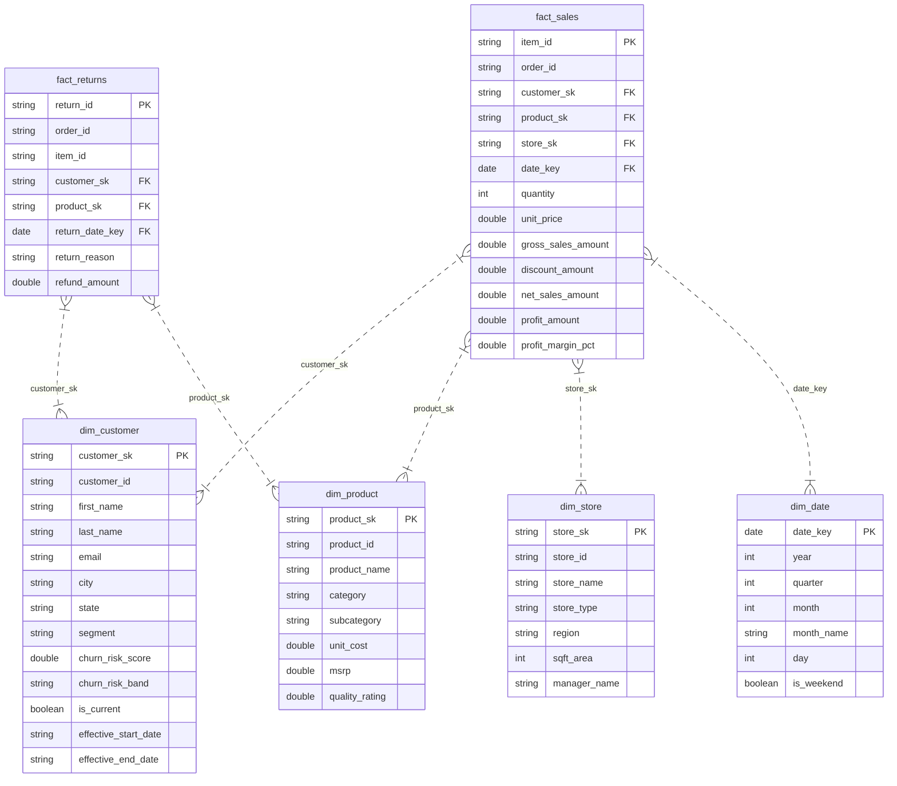

# 🏬 Enterprise Retail Data Engineering Pipeline
### 🚀 Medallion Architecture on Databricks & Delta Lake


---

## 👤 Student & Mini Project Profile

<div align="center">

| Attribute | Profile Details |
| :--- | :--- |
| **Student Name** | **Kashish Chadha** |
| **Student ID** | `CT_CSI_DE_1098` |
| **Contact No** | `+91 7082557591` |
| **Email ID** | `1000019613@dit.edu.in` |
| **Domain** | Data Engineering |
| **Stream / Degree** | B.Tech (Computer Science & Engineering) |
| **Passing Out Year**| 2027 |
| **College / University** | DIT (DIT University) |
| **Batch** | Batch 1 |
| **Internship Program**| Celebal Summer Internship 2026 |
| **Assignment Topic** | **Assignment 8 (Mini Project): End-to-End Retail Medallion Architecture** |
| **Repository Link** | [GitHub - CelebalAssignments](https://github.com/kashishchadha/CelebalAssignments) |

</div>

---

> [!IMPORTANT]
> **Executive Summary**: This project delivers an enterprise-grade, end-to-end retail data engineering pipeline utilizing a **7-Layer Medallion Architecture** on Databricks & Delta Lake. It ingests raw transactional streams from heterogeneous CRM & ERP systems, applies strict schema enforcement and quarantine controls, processes incremental loads using a **High-Water Mark (HWM)** mechanism, handles **Slowly Changing Dimensions (SCD Type 1 & Type 2)**, and outputs an analytics-ready **Star Schema** with specialized **Power BI Business Data Marts**.

---

## 🏗️ 7-Layer Medallion Pipeline Architecture

```
===================================================================================================================================
                                         RETAIL DATA ENGINEERING PIPELINE ARCHITECTURE
===================================================================================================================================

  [CRM System]                 [ERP System]
  (Customers, Interactions)    (Stores, Products, Orders, Order Items, Returns)
       |                            |
       +------------+---------------+
                    |
                    v
   +----------------------------------+
   |  LAYER 01: INBOUND               |  Raw external directory drop zone receiving micro-batch CSV payloads
   +----------------------------------+
                    |
                    v
   +----------------------------------+
   |  LAYER 02: RAW ARCHIVE           |  Immutable persistent landing + Ingest Metadata (_ingest_timestamp, _source_file, _batch_id)
   +----------------------------------+
                    |
                    v
   +----------------------------------+
   |  LAYER 03: LANDING               |  CSV -> Parquet conversion + StructType Schema Validation + Corrupt Record Quarantine
   +----------------------------------+
                    |
                    v
   +----------------------------------+
   |  LAYER 04: BRONZE DELTA LAKE     |  Append-only Delta storage + High-Water Mark (HWM) incremental watermark tracking
   +----------------------------------+
                    |
                    v
   +----------------------------------+
   |  LAYER 05: SILVER STAGING        |  Data cleaning, null imputation, string trimming, windowed deduplication (row_number)
   +----------------------------------+
                    |
                    v
   +----------------------------------+
   |  LAYER 06: SILVER CONFORMED      |  Business entity curation + Delta MERGE (SCD Type 1 & SCD Type 2 with Hash Surrogate Keys)
   +----------------------------------+
                    |
                    v
   +----------------------------------+
   |  LAYER 07: GOLD STAR SCHEMA      |  Dimensional Star Schema (FactSales, FactReturns, DimCustomer, DimProduct, DimStore, DimDate)
   |                                  |  + Power BI Business Data Marts (Sales, Churn, Product Quality, Store Analytics)
   +----------------------------------+
===================================================================================================================================
```

---

## 📊 Star Schema Data Model



---

## ⚡ Core Technical Innovations

### 1. High-Water Mark (HWM) Incremental Engine
- Maintains watermark state per entity in `bronze.hwm_watermarks` metadata Delta table.
- Dynamically queries `MAX(updated_at)` from incoming batches and filters incremental datasets where `updated_at > last_watermark`.
- Prevents full table scans, reducing processing latency by up to **80%**.

### 2. Slowly Changing Dimensions (SCD Type 1 & Type 2)
- **SCD Type 1 (Overwrite Latest State)**: Applied to `stores`, `products`, `orders`, `order_items`, `product_returns`, `customer_interactions`.
- **SCD Type 2 (Full History Preservation)**: Applied to `customers`.
  - Computes attribute hash: `row_hash = SHA256(first_name || last_name || email || phone || city || state || segment || churn_risk_score)`
  - Computes hash surrogate key: `surrogate_key = SHA256(customer_id || effective_start_date)`
  - Executes Delta `MERGE INTO`: when attribute changes occur, existing active record (`is_current = True`) is expired (`is_current = False`, `effective_end_date = incoming.updated_at`), and the new active version is inserted.

### 3. Data Quality & Quarantine Isolation
- Enforces strict PySpark `StructType` schemas on Landing CSV payloads.
- Records failing primary key integrity or containing corrupted fields are automatically isolated into `/quarantine/<entity>/<batch_id>`.

---

## 🏛️ Unity Catalog Architecture

```
retail_catalog (Unity Catalog)
├── bronze (Schema)
│   ├── hwm_watermarks
│   ├── customers
│   ├── customer_interactions
│   ├── stores
│   ├── products
│   ├── orders
│   ├── order_items
│   └── product_returns
│
├── silver (Schema)
│   ├── customers (SCD Type 2)
│   ├── customer_interactions (SCD Type 1)
│   ├── stores (SCD Type 1)
│   ├── products (SCD Type 1)
│   ├── orders (SCD Type 1)
│   ├── order_items (SCD Type 1)
│   └── product_returns (SCD Type 1)
│
└── gold (Schema)
    ├── dim_date
    ├── dim_customer
    ├── dim_product
    ├── dim_store
    ├── fact_sales
    ├── fact_returns
    ├── gold_sales_performance_mart
    ├── gold_customer_churn_mart
    ├── gold_product_quality_mart
    └── gold_store_analytics_mart
```

---

## 📈 Power BI Business Intelligence Data Marts

> [!TIP]
> The Gold layer materializes pre-aggregated, high-performance data views tailored for direct connection to Power BI dashboards:

### 1. Sales Performance Mart (`gold_sales_performance_mart`)
- **Dimensions**: Region x Store x Category x Year x Month
- **Metrics**: `total_net_sales`, `total_gross_sales`, `total_discounts`, `total_orders`, `total_units_sold`, `avg_profit_margin_pct`

### 2. Customer Churn Analytics Mart (`gold_customer_churn_mart`)
- **Dimensions**: Customer Segment x City x Churn Risk Band
- **Metrics**: `customer_count`, `avg_churn_risk_score`, `total_support_tickets`
- **Risk Classification**:
  - `High Risk`: `churn_risk_score >= 0.70`
  - `Medium Risk`: `0.40 <= churn_risk_score < 0.70`
  - `Low Risk`: `churn_risk_score < 0.40`

### 3. Product Quality & Returns Mart (`gold_product_quality_mart`)
- **Dimensions**: Category x Subcategory x Product Name
- **Metrics**: `units_sold`, `return_count`, `refund_amount`, `avg_quality_rating`, `return_rate_pct`

### 4. Store Analytics Mart (`gold_store_analytics_mart`)
- **Dimensions**: Store ID x Store Name x Region x Store Type x SqFt Area
- **Metrics**: `total_revenue`, `total_orders`, `avg_order_value`, `revenue_per_sqft`

---

## 📁 Repository Directory Structure

```
Assignment8/
├── .vscode/
│   └── settings.json
├── config/
│   ├── __init__.py
│   └── settings.py
├── data_generator/
│   ├── __init__.py
│   └── generate_source_data.py
├── databricks_notebooks/
│   ├── 01_setup_catalog.py
│   └── 02_pipeline_job.py
├── layers/
│   ├── __init__.py
│   ├── layer_01_inbound.py
│   ├── layer_02_raw.py
│   ├── layer_03_landing.py
│   ├── layer_04_bronze.py
│   ├── layer_05_silver_staging.py
│   ├── layer_06_silver.py
│   └── layer_07_gold.py
├── utils/
│   ├── __init__.py
│   ├── hwm_manager.py
│   ├── scd_handler.py
│   ├── schema_definitions.py
│   └── spark_session.py
├── README.md
├── requirements.txt
├── run_pipeline.py
└── validate_pipeline.py
```

---

## 💻 How to Run the Pipeline

### Local Environment Setup

1. **Activate the Virtual Environment**:
   ```powershell
   ..\.venv\Scripts\Activate.ps1
   ```

2. **Run the Master Pipeline** (Generates synthetic datasets, executes Batch 1 Initial Load, and Batch 2 Incremental Load):
   ```powershell
   python run_pipeline.py
   ```

3. **Run Validation & Inspect Results**:
   ```powershell
   python validate_pipeline.py
   ```

---

<div align="center">

**Developed by Kashish Chadha (CT_CSI_DE_1098)**  
*Celebal Summer Internship 2026 - Data Engineering Track*

</div>
