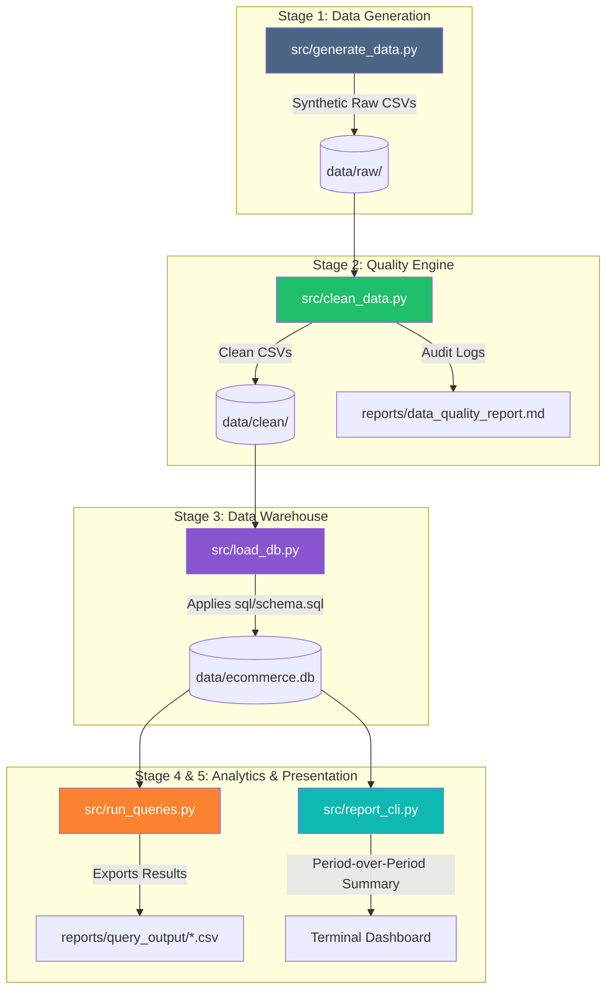

# 🚀 Celebal Technologies — Data Engineering Internship Master Portfolio

[](https://celebaltech.com)
[](#-intern-profile)
[](https://python.org)
[](https://spark.apache.org/)
[](https://azure.microsoft.com/)
[](https://delta.io/)
[](#-week-by-week-internship-journey)

---

## 👤 Intern Profile

<div align="center">

| Student Detail | Information |
| :--- | :--- |
| **Name** | **Kashish Chadha** |
| **Student ID** | `CT_CSI_DE_1098` |
| **Internship Program** | **Celebal Summer Internship (CSI) 2026** |
| **Domain** | **Data Engineering** |
| **Stream / Degree** | **B.Tech — Computer Science & Engineering** |
| **College / University** | **DIT University, Dehradun** |
| **Passing Out Year** | **2027** |
| **Batch** | **Batch 1** |
| **Start Date** | **15th June 2026** |
| **Contact Number** | `+91 7082557591` |
| **Email ID** | `1000019613@dit.edu.in` |

</div>

---

## 📌 Executive Summary

This master repository serves as the official portfolio showcasing the complete **8-Week Data Engineering Internship Journey** at **Celebal Technologies**.

Across 8 intensive modules, this portfolio tracks the progression from foundational exploratory data analysis and relational database optimization to serverless Azure cloud orchestration, large-scale distributed computing with Apache Spark, lakehouse transaction management with Delta Lake, and full-stack production pipeline deployment.


---

## 📁 Repository Map

```text
CelebalAssignments/
├── 📄 README.md                        # Master Portfolio Documentation (This File)
│
├── 📂 Assignment1/                     # Week 1: Python EDA, Preprocessing & Feature Engineering
│   ├── 📄 README.md
│   ├── 📁 data/                        # Combined raw & cleaned Myntra shopping datasets
│   └── 📁 notebook/                    # analysis.ipynb (EDA, Price Cleaning, Metrics)
│
├── 📂 Assignment2/                     # Week 2: E-Commerce Sales Database Analysis (SQL/SQLite)
│   ├── 📄 README.md
│   ├── 📁 data/                        # Superstore.csv, schema.sql, data.sql, shopease.db
│   └── 📁 notebook/                    # SQL_Assignment.ipynb (Relational SQL & ACID)
│
├── 📂 Assignment3/                     # Week 3: Advanced SQL — CTEs, Subqueries & Window Functions
│   ├── 📄 README.md
│   ├── 📁 data/                        # Sample Superstore dataset
│   ├── 📁 sql/                         # schema.sql, queries.sql (Window functions, CTEs)
│   └── 📁 notebook/                    # analysis.ipynb (Ranking, Partitioning & Subqueries)
│
├── 📂 Assignment4/                     # Week 4: Azure Data Factory Cloud Pipeline (PL_CopyAndValidate)
│   ├── 📄 README.md
│   ├── 📁 report/                      # Week4_Assignment_Report.docx (Complete Cloud Architecture)
│   └── 📁 screenshots/                 # 11 ADF & Blob Storage execution verification images
│
├── 📂 Assignment5/                     # Week 5: PySpark DataFrames — Data Quality & Transformations
│   ├── 📄 README.md
│   ├── 📁 data/                        # Transactions generator & raw dataset
│   ├── 📁 output/                      # store_revenue.csv
│   └── 📁 notebook/                    # week5_spark_analysis.ipynb (15 PySpark Q&A Solutions)
│
├── 📂 Assignment6/                     # Week 6: PySpark Architecture, Columnar Parquet & Filters
│   ├── 📄 README.md
│   ├── 📁 data/                        # Source CSVs & input Parquet storage files
│   ├── 📁 output/                      # 7 analytical CSV output deliverables
│   └── 📁 notebook/                    # Spark_Assignment.ipynb (DAG Lineage, Pushdown, Schema)
│
├── 📂 Assignment7/                     # Week 7: Delta Lakehouse — ACID MERGE (SCD Type 1 & Type 2)
│   ├── 📄 README.md
│   ├── 📁 data/                        # Customer master & incremental change datasets
│   ├── 📁 notebooks/                   # 01_pandas_basics.ipynb & 02_delta_lake_merge.ipynb
│   ├── 📁 scripts/                     # setup verification & automated screenshot generators
│   └── 📁 report/                      # Comprehensive Delta Lake architectural report
│
└── 📂 Assignment8/                     # Week 8: End-to-End Production Analytics Pipeline & Terminal CLI
    ├── 📄 README.md
    ├── ⚙️ config.py                    # Centralized pipeline configuration & data generation knobs
    ├── 📁 data/                        # Raw, clean CSV storage & ecommerce.db SQLite warehouse
    ├── 📁 reports/                     # Quality audit logs (.md/.json) & query CSV exports
    ├── 📁 sql/                         # schema.sql, 01_basic.sql, 02_intermediate.sql, 03_advanced.sql
    ├── 📁 src/                         # ETL scripts (generate, clean, load, query runner, report_cli)
    └── 📁 tests/                       # test_edge_cases.py (14 Pytest unit tests)
```

---

## 🛠️ Technology Stack & Competency Matrix

| Technology / Domain | Capabilities & Concepts Applied | Assignment References |
| :--- | :--- | :--- |
| **Python 3.10+ & Pandas** | Data Cleaning, RegEx Parsing, Type Casting, Outlier Detection, Feature Engineering | [Week 1](Assignment1) \| [Week 5](Assignment5) \| [Week 7](Assignment7) \| [Week 8](Assignment8) |
| **SQL & Relational Databases** | DDL/DML, Constraints (PK/FK/CHECK), Aggregations, Joins, Window Functions (`RANK`, `ROW_NUMBER`), CTEs, Subqueries, Views | [Week 2](Assignment2) \| [Week 3](Assignment3) \| [Week 8](Assignment8) |
| **Microsoft Azure & ADF** | Azure Data Factory, Blob Containers, Linked Services, `Get Metadata` Validation, `Copy Data` activity, RBAC, Managed Identities | [Week 4](Assignment4) |
| **Apache Spark / PySpark** | Catalyst Optimizer, Lazy Evaluation, DAG Lineage, MapReduce vs Spark, Predicate Pushdown, ANSI casting, `dropDuplicates`, `.agg()` | [Week 5](Assignment5) \| [Week 6](Assignment6) |
| **Delta Lake & Lakehouse** | ACID Transactions, Time Travel, `MERGE INTO`, Slowly Changing Dimensions (**SCD Type 1 & SCD Type 2**), Transaction Log (`_delta_log`) | [Week 7](Assignment7) |
| **Software Engineering & QA** | Modular Pipeline Architecture, Central Config, Pytest Unit Testing, Markdown/JSON Audit Logging, Terminal CLI Dashboards | [Week 8](Assignment8) |

---

## 🗓️ Week-by-Week Internship Journey

---

### 🟢 Week 1 — Exploratory Data Analysis & Data Preprocessing
**Project:** [Assignment 1 — Myntra Shopping Dataset Analysis](Assignment1)

#### 🎯 Objectives & Context
Raw e-commerce datasets are plagued by inconsistent text, currency formatting, missing values, and unrefined metrics. Week 1 established fundamental data engineering workflows using Python and Pandas to clean, transform, and analyze over 1,000 product listings from Myntra.

```
Raw CSV Dataset ──> Currency Cleaning & Null Imputation ──> Feature Engineering ──> Business Insights & Visualizations
```

#### 🔑 Key Accomplishments
- **Data Cleaning Engine:** Stripped currency formatting (e.g., `Rs.`, `,`) from pricing fields and cast them to continuous numeric values.
- **Null & Duplicate Handling:** Evaluated missing value distributions; systematically imputed or dropped incomplete records and eliminated duplicate entries.
- **Feature Engineering:** Derived 3 business-critical synthetic metrics:
  1. **Price Difference ($\Delta P$):** $\text{Original Price} - \text{Discounted Price}$.
  2. **Popularity Score:** Weighted interaction metric combining product rating ($R$) and total rating count ($N$):
     $$\text{Popularity} = R \times \log_{10}(N + 1)$$
  3. **Total Purchase Value:** Monetary estimate derived from pricing and customer volume.
- **Exploratory Visualizations:** Built category-wise distribution charts, price distribution box plots, rating vs popularity scatter plots, and top-performing product rankings using Matplotlib and Seaborn.

---

### 🟢 Week 2 — E-Commerce Sales Database Analysis (SQL & SQLite)
**Project:** [Assignment 2 — Relational Sales Database & ACID Analysis](Assignment2)

#### 🎯 Objectives & Context
Transitioned from flat CSV files to relational database management systems (RDBMS). Designed a normalized 4-table schema (`Customers`, `Products`, `Orders`, `Order_Items`), executed structured SQL operations, and evaluated database transaction mechanics.

```
Customers ──(1:N)──> Orders ──(1:N)──> Order_Items <──(N:1)── Products
```

#### 🔑 Key Accomplishments
- **Database Schema Modeling:** Designed relational tables with explicit Primary Keys, Foreign Keys, `NOT NULL`, `UNIQUE`, and `CHECK` constraints.
- **Data Retrieval & Filtering:** Mastered `WHERE`, `BETWEEN`, `LIKE`, `IN`, and multi-clause logical expressions (`AND`/`OR`/`NOT`).
- **Aggregation & Summary Metrics:** Formulated complex SQL queries utilizing `GROUP BY` and `HAVING` to summarize regional revenue, monthly demand patterns, and customer purchase frequencies.
- **Relational Joins:** Implemented `INNER JOIN` and `LEFT JOIN` operations across multi-table hierarchies to compile product-level line item billing details.
- **Transactions & Index Optimization:** Demonstrated ACID compliance (`COMMIT` / `ROLLBACK` blocks), investigated index optimization, and evaluated SARGable (Search Argument Able) query design to prevent full table scans.

---

### 🟢 Week 3 — Advanced SQL Analysis: Subqueries, CTEs & Window Functions
**Project:** [Assignment 3 — Superstore Advanced SQL Analytics](Assignment3)

#### 🎯 Objectives & Context
Analyzed the Sample Superstore retail dataset by executing advanced SQL query patterns, complex window analytical functions, and multi-stage Common Table Expressions (CTEs) in SQLite.

#### 🔑 Key Accomplishments
- **Database Normalization:** Ingested `Sample - Superstore.csv` into raw landing tables, and normalized the data using `SELECT DISTINCT` into 3 clean relational tables: `customers` (793 rows), `products` (1,894 rows), and `orders` (9,994 line items).
- **Subqueries & CTE Architecture:** Wrote nested subqueries to identify orders exceeding overall historical averages and maximum sale orders per customer. Implemented CTEs (`WITH` clauses) for modular query execution.
- **Window Functions & Ranking:** Mastered window operations using `OVER (PARTITION BY ... ORDER BY ...)`:
  - `ROW_NUMBER()`: Sequential row indexing across customer transaction histories.
  - `RANK()` & `DENSE_RANK()`: Ranking customer segments and top revenue contributors.
- **Combined Analytical Queries:** Built unified queries combining multi-table `JOIN` statements, CTE definitions, and window ranking to extract top 5 / bottom 5 customer cohorts, single-order buyer profiles, and highest order values.

---

### 🟢 Week 4 — Azure Cloud Data Engineering Pipeline (Azure Data Factory)
**Project:** [Assignment 4 — Azure Data Pipeline `PL_CopyAndValidate`](Assignment4)

#### 🎯 Objectives & Context
Constructed a serverless cloud ETL pipeline on Microsoft Azure using Azure Data Factory (ADF) and Azure Blob Storage, implementing the cloud-native **metadata-check-then-copy** validation pattern.

```
┌────────────────────────────────┐         ┌────────────────────────────────┐
│   Get Metadata1 Activity       │────────▶│      Copy data1 Activity       │
│  (Validates Source CSV File)   │ SUCCESS │ (Transfers Data to Destination)│
└────────────────────────────────┘         └────────────────────────────────┘
```

#### 🔑 Key Accomplishments
- **Cloud Resource Provisioning:** Provisioned Azure Resource Groups, Storage Accounts, Blob Storage Containers (`raw-data` landing zone & `processed-data` destination zone), and an Azure Data Factory instance.
- **Pipeline Orchestration (`PL_CopyAndValidate`):**
  - **`Get Metadata` Activity:** Pre-validates source file existence, byte size, and last-modified timestamp in Blob storage. Fails fast if the file is absent or corrupted.
  - **`Copy Data` Activity:** Triggered only upon metadata validation success; securely moves CSV datasets between storage containers.
- **Identity & Access Management (IAM):** Configured Azure Role-Based Access Control (RBAC) using Managed Identities. Enforced least-privilege security by distinguishing control-plane access (`Reader`) from data-plane execution permissions (`Storage Blob Data Contributor`).
- **Monitoring & Audit Trails:** Executed debug runs, monitored activity timelines, verified run IDs, and authored a comprehensive architectural report ([Week4_Assignment_Report.docx](Assignment4/report/Week4_Assignment_Report.docx)).

---

### 🟢 Week 5 — Distributed Data Transformations with PySpark DataFrames
**Project:** [Assignment 5 — PySpark Data Cleaning & Aggregation Pipeline](Assignment5)

#### 🎯 Objectives & Context
Entered large-scale distributed computing by answering 15 technical PySpark architecture and implementation questions applied against a synthetic 10,494-row transaction dataset generated from Superstore.

#### 🔑 Key Accomplishments
- **Architectural Analysis:** Compared MapReduce disk I/O bottlenecks against Spark DAG in-memory computing models. Evaluated memory caching (`.cache()`) for iterative machine learning loops.
- **DataFrame Transformation Suite:**
  - **Subset De-duplication:** Collapsed duplicate payment retries via `df.dropDuplicates(["user_id", "transaction_date"])`.
  - **Conditional Aggregations:** Filtered category averages across geographical regions (e.g., West region category sale means).
  - **Null Handling Strategies:** Analyzed `.na.drop()` vs `.na.fill()` impact on mathematical aggregations (e.g., filled 627 missing statuses with `'Unknown'`).
  - **ANSI Type Casting:** Handled Spark 4 ANSI compliance by utilizing `try_cast` for timestamp parsing to prevent runtime job exceptions.
  - **Data Quality & Filter Chains:** Sanitized bad inputs using `.isNotNull()` and `.trim()` checks to remove whitespace usernames.
- **Shuffle Mechanics & Physical Plans:** Analyzed Spark physical execution plans (`Exchange hashpartitioning`) to understand narrow vs wide dependency boundaries.

---

### 🟢 Week 6 — PySpark Architecture, Columnar Parquet & Analytics
**Project:** [Assignment 6 — PySpark Deep Dive & Superstore Analytics](Assignment6)

#### 🎯 Objectives & Context
Deepened PySpark expertise by investigating distributed cluster architecture, columnar storage mechanics (Parquet vs CSV), DAG fault tolerance, and building an automated sales analytics pipeline exporting 7 output deliverables.

```
                       +-----------------------------------+
                       |           DRIVER NODE             |
                       |  SparkSession / DAG Scheduler     |
                       +-----------------+-----------------+
                                         |
                            Cluster Manager (YARN/K8s)
                                         v
              +--------------------------+--------------------------+
              |                                                     |
              v                                                     v
     +------------------+                                  +------------------+
     |    EXECUTOR 1    |                                  |    EXECUTOR 2    |
     | Task Execution   |                                  | Task Execution   |
     +------------------+                                  +------------------+
```

#### 🔑 Key Accomplishments
- **Cluster Architecture Mapping:** Detailed Driver node, Cluster Manager (YARN/Kubernetes/Standalone), and Executor JVM container roles across Client Mode vs Cluster Mode deployment topologies.
- **Parquet Storage & Predicate Pushdown:** Compared row-oriented CSV files against columnar Parquet storage. Demonstrated **Predicate Pushdown** (skipping unneeded Row Groups using footer statistics) to eliminate memory overhead.
- **DAG Lineage & Fault Tolerance:** Explained how Spark reconstructs lost partitions dynamically using immutable RDD/DataFrame lineage graphs without expensive data replication.
- **Memory Safety Protocols:** Evaluated driver memory crash mechanics (`Java OutOfMemoryError`) caused by `.collect()` on multi-terabyte datasets vs safe partition inspection using `.show(5)`.
- **Pipeline Deliverables:** Executed complex filtering, column mutation, and tax addition logic ($18\%$ tax calculation), exporting 7 structured CSV output files to [`Assignment6/output/`](Assignment6/output/).

---

### 🟢 Week 7 — Delta Lakehouse: ACID Transactions & Incremental MERGE
**Project:** [Assignment 7 — Delta Lake Cleaning & Incremental MERGE (SCD 1 & 2)](Assignment7)

#### 🎯 Objectives & Context
Implemented modern Data Lakehouse storage architecture using Delta Lake. Developed dual Jupyter notebooks covering initial data cleaning and executing atomic `MERGE INTO` operations for **Slowly Changing Dimensions (SCD Type 1 & Type 2)**.

```sql
MERGE INTO target_table AS t
USING source_batch AS s
ON t.customer_id = s.customer_id
WHEN MATCHED AND s.updated_at > t.updated_at THEN UPDATE SET *
WHEN NOT MATCHED THEN INSERT *
```

#### 🔑 Key Accomplishments
- **ACID Transaction Logging:** Configured Delta Lake table storage (`_delta_log`), enabling ACID transactional guarantees, schema enforcement, and Time Travel capability (`VERSION AS OF`).
- **SCD Type 1 (In-Place Overwrite):** Built incremental `MERGE` pipelines to overwrite outdated customer attributes (e.g., address, phone number) without maintaining historical records.
- **SCD Type 2 (Full History Tracking):** Implemented historical versioning using effective date tracking (`start_date`, `end_date`) and active status flags (`is_current = True/False`).
- **Production Edge-Case Mitigations:** Solved 3 major production Delta Lake gotchas:
  1. **Source De-duplication:** Windowed batch inputs (`row_number()`) prior to `MERGE` to eliminate *Multiple Source Match* exceptions.
  2. **Out-of-Order Timestamp Guard:** Protected updates with timestamp comparisons (`s.updated_at > t.updated_at`) to prevent stale data overwrites.
  3. **Null-Safe Equality Checks:** Applied `<=>` operators to prevent redundant no-op updates and log bloat.

---

### 🟢 Week 8 — End-to-End Production Analytics Pipeline & Terminal CLI
**Project:** [Assignment 8 — End-to-End E-Commerce Analytics Pipeline](Assignment8)

#### 🎯 Objectives & Context
Synthesized all internship competencies by architecting a production-grade, modular 5-stage ETL/ELT e-commerce analytics pipeline. Built a synthetic data generator with injected defects, automated cleaning engine, SQLite database warehouse, 15-query analytical SQL suite, and an interactive terminal CLI dashboard.



#### 🔑 Key Accomplishments
- **Modular Pipeline Architecture:** Built decoupled scripts controlled via central configuration ([`config.py`](Assignment8/config.py)).
- **Synthetic Fault Injector:** Injected controlled data quality anomalies (5% null customer IDs, 3% negative quantities, bad date formats, return-prone SKUs, orphan items).
- **Data Quality Engine:** Standardized ISO dates, clipped out-of-range discounts, isolated rejected orphan rows into `rejected_order_items.csv`, and authored automated quality audit logs (`.md` / `.json`).
- **Relational Storage & SQL Analytics:** Loaded cleaned data into SQLite enforcing foreign keys and centralized revenue logic inside the `item_revenue` SQL view. Executed 15 analytical SQL queries covering revenue trends, top customers, YoY growth, and return rates.
- **Interactive Terminal CLI:** Implemented `src/report_cli.py` supporting period-over-period metric comparisons (Orders, Revenue, Unique Customers, % Change), AOV computation, top products, and daily/weekly/monthly breakdowns.
- **Unit Testing Suite:** Verified pipeline determinism and edge-case handling with 14 automated unit tests using `pytest`.

---

## ⚡ Quick Start & Setup Guide

### 1. Repository Setup

```bash
# Clone the repository
git clone https://github.com/kashishchadha/CelebalAssignments.git
cd CelebalAssignments

# Create a master virtual environment
python -m venv .venv
```

### 2. Virtual Environment Activation

- **Windows (PowerShell):**
  ```powershell
  .\.venv\Scripts\activate
  ```
- **macOS / Linux:**
  ```bash
  source .venv/bin/activate
  ```

### 3. Dependency Installation

```bash
pip install --upgrade pip
pip install pandas numpy matplotlib seaborn pytest pyspark pyarrow delta-spark jupyter
```

### 4. Running Assignment Pipelines

- **Run Week 8 Production Pipeline:**
  ```bash
  cd Assignment8
  python src/generate_data.py
  python src/clean_data.py
  python src/load_db.py
  python src/run_queries.py
  ```

- **Launch Week 8 Terminal CLI Report:**
  ```bash
  python src/report_cli.py --type monthly --from 2025-01-01 --to 2025-06-30
  ```

- **Run Pytest Test Suites:**
  ```bash
  # Inside Assignment8
  pytest -v
  ```

---

## 🎓 Summary of Key Learnings & Engineering Principles

1. **Resilient Pipeline Design:** Never crash on incoming dirty data. Validate, clean restorable fields, isolate unresolvable records, and maintain transparent audit trails.
2. **Centralized Logic (DRY):** Avoid duplicating calculations across analytics queries; encapsulate business rules inside SQL views or central module configurations.
3. **Storage Efficiency:** Leverage columnar formats (Parquet/Delta) and Predicate Pushdown for large-scale analytics to minimize disk I/O and executor memory footprints.
4. **Data Lake Integrity:** Modern Data Lakehouses require ACID transaction logging and explicit `MERGE` guards (de-duplication & timestamp ordering) to prevent duplicate matches and stale overwrites.
5. **Cloud Best Practices:** Enforce strict separation between resource management (control-plane) and data access (data-plane) using Azure RBAC and Managed Identities.

---

## 📬 Contact & Internship Verification

<div align="center">

**Kashish Chadha**  
*Data Engineering Intern — Batch 1*  
Celebal Technologies Summer Internship 2026  

📧 Email: [1000019613@dit.edu.in](mailto:1000019613@dit.edu.in) | 📱 Phone: +91 7082557591  
🎓 DIT University, Dehradun — B.Tech CSE (Class of 2027)  

</div>
